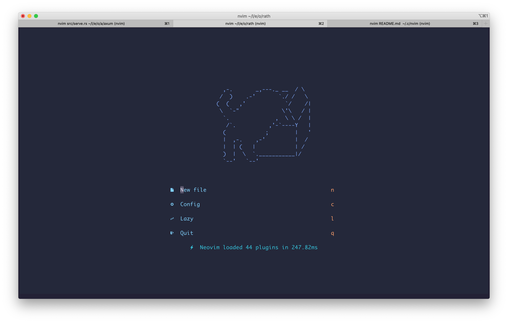
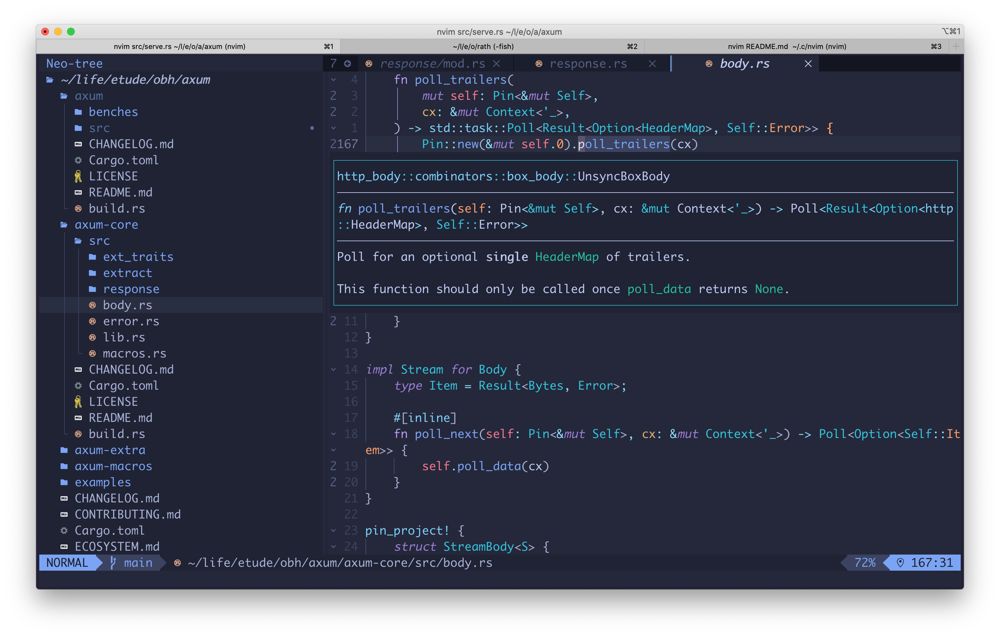

# 👋 Greeting

This repo contains my `nvim` **R**un**C**ommand file.

# Screenshots

## greeter screen ([alpha-nvim](https://github.com/goolord/alpha-nvim))

## code with Tree ([neo-tree.nvim](https://github.com/nvim-neo-tree/neo-tree.nvim))

> - Terminal: iterm2
> - Shell: fish
> - Font: Monaco Regular
> - Scheme: [tokyonight](https://github.com/folke/tokyonight.nvim)
